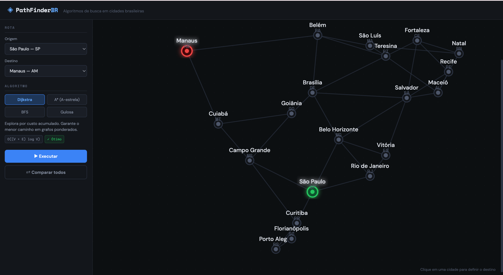
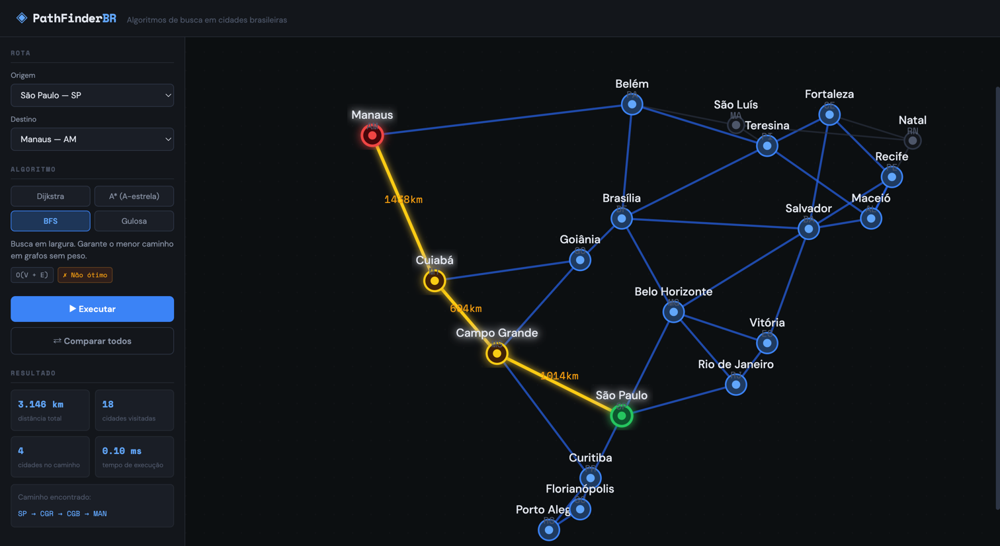

# PathFinder BR

**Conteúdo da disciplina:** Grafos

## Alunos

| Matrícula  | Aluno                              |
| ---------- | ---------------------------------- |
| 211030667  | Ana Luíza Fernandes Alves da Rocha |
| 211041295  | Tales Rodrigues Gonçalves          |

## Conteúdo da disciplina

- **Grafos**
    - **1.1. Ordenação Topológica**
    - **1.2. Componentes Fortemente Conectados**
    - **1.3. Algoritmo de Dijkstra**
    - **1.4. Algoritmo A\***
    - **1.5. Árvore Geradora Mínima**

## Sobre

Este trabalho apresenta uma aplicação web interativa para visualização de algoritmos aplicados em **grafos**, utilizando como cenário uma malha de **cidades brasileiras conectadas por arestas com pesos em quilômetros**.

O projeto foi desenvolvido com foco na exploração prática de conceitos da disciplina de Grafos, especialmente os algoritmos de **Dijkstra** e **A\***, permitindo ao usuário selecionar uma cidade de origem e uma cidade de destino para calcular e visualizar rotas no grafo.

A aplicação representa o problema por meio de um **grafo ponderado não direcionado**, em que:

- cada **vértice** representa uma cidade;
- cada **aresta** representa uma conexão entre cidades;
- cada peso corresponde à **distância** entre os pontos.

Além da execução dos algoritmos, o sistema exibe:

- **animação passo a passo** dos vértices visitados;
- **rota final destacada visualmente** no grafo;
- **comparação entre algoritmos**, considerando distância total, quantidade de nós explorados e tempo de execução;
- visualização de apoio para compreender diferenças entre estratégias de busca.

O projeto utiliza dados de cidades brasileiras e uma interface gráfica para tornar a análise dos algoritmos mais intuitiva, didática e visual.

## Funcionalidades

- Seleção de **cidade de origem** e **cidade de destino**
- Execução dos algoritmos:
    - **Dijkstra**
    - **A\***
    - **BFS**
    - **Greedy Best-First Search**
- Animação da ordem de visita dos nós
- Exibição do caminho encontrado
- Comparação de desempenho entre algoritmos
- Visualização gráfica do grafo em mapa esquemático
- Apresentação de métricas como:
    - distância total
    - nós explorados
    - tempo de execução

## Estrutura do projeto

```text
pathfinder/
├── src/
│   ├── algorithms/
│   │   ├── MinHeap.ts
│   │   └── search.ts
│   ├── components/
│   │   ├── ComparisonPanel.tsx
│   │   ├── GraphCanvas.tsx
│   │   └── Sidebar.tsx
│   ├── data/
│   │   └── cities.ts
│   ├── types/
│   │   └── index.ts
│   ├── App.tsx
│   ├── App.css
│   └── main.tsx
├── index.html
├── package.json
├── tsconfig.json
└── vite.config.ts
```

## Tecnologias utilizadas
- TypeScript
- React
- Vite
- HTML/CSS
- Estruturas de dados implementadas manualmente, como heap mínima
- Conceitos de grafos aplicados no projeto

## Este trabalho se relaciona diretamente com os seguintes conceitos estudados na disciplina:
- representação de grafos ponderados
- busca e exploração de caminhos
- cálculo de menor caminho
- uso de heurística no algoritmo A*
- comparação entre diferentes estratégias de busca
- análise de eficiência com base em número de nós visitados e custo do caminho

## Imagens da aplicação em execução:

### Tela inicial


### Grafo com rota destacada e Exibição dos passos da busca


### Vídeo de apresentação
Neste vídeo, apresentamos um resumo completo do trabalho desenvolvido, abordando os principais conceitos teóricos e a demonstração prática da aplicação.

[Assista no YouTube](https://youtu.be/E6-dtBYbKoc) 

## Instalação
### Linguagem e stack
- TypeScript
- React
- Vite
### Pré-requisitos
- Node.js (recomenda-se versão LTS recente)
- npm

### Como rodar
- Clone o repositório

``` bash
 git clone https://github.com/projeto-de-algoritmos-2026/G28_Grafos_PA-26.1.git
```

- Acesse a pasta do projeto

- cd <seu-projeto>

- Instale as dependências

``` bash
 npm install
```

- Inicie o servidor de desenvolvimento

``` bash
 npm run dev
```
- Abra o navegador em: http://localhost:5173/
